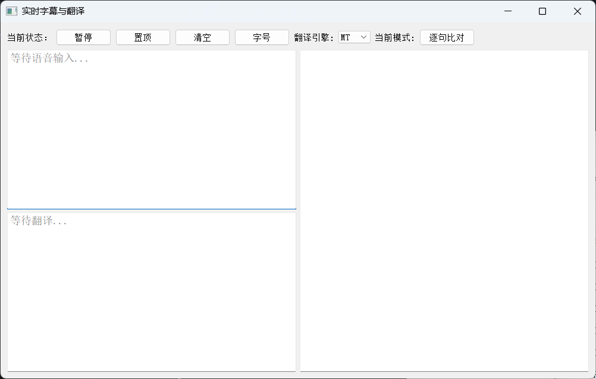
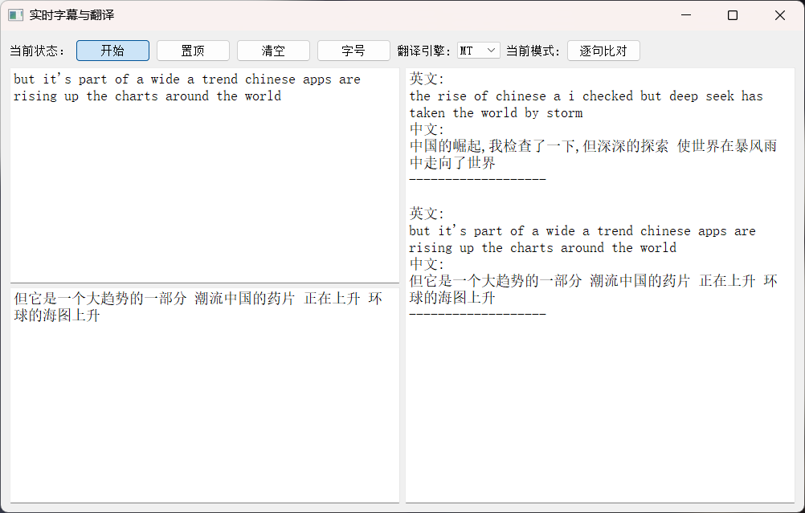
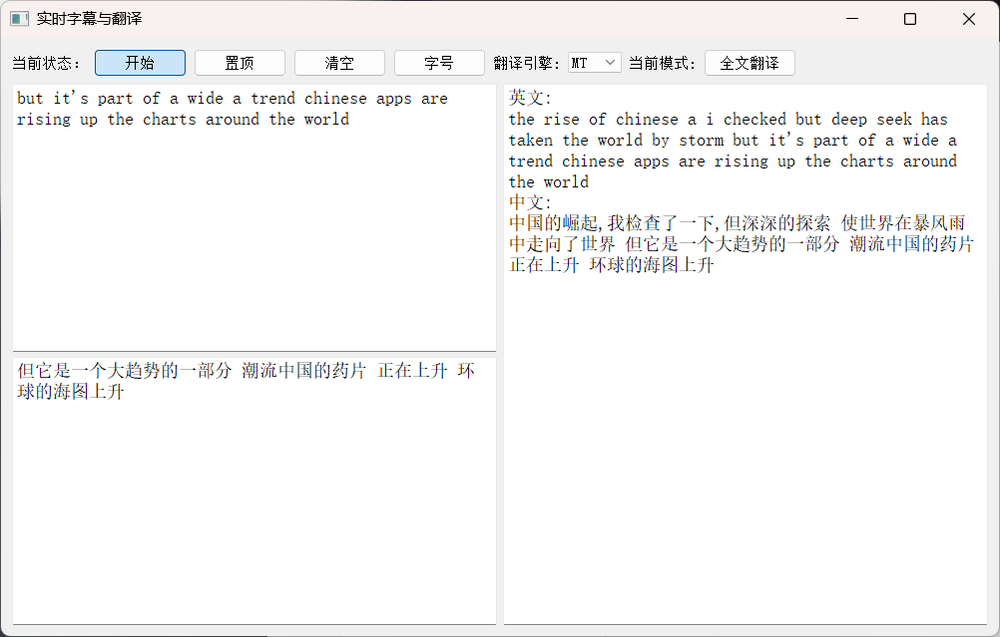

# 实时字幕与翻译

[English version introduction](README_en.md)

## 概述



这是我做的一个根据系统声音实时显示英文字幕与中文翻译的软件，功能如下：

- 打开软件后默认暂停状态，需要点击按钮进入开始状态，此时开始识别英文，在左侧上方文本框中显示当前的英文句子，左侧下方文本框显示当前语句的翻译结果，右侧文本框显示历史信息（左侧只展示当前正在识别的一句话，右侧显示从开始到现在的所有句子）；
- "翻译引擎"按钮控制两种翻译的模式，默认是"MT"机器翻译模式，可使用"LLM"大模型模式，具体模型使用参见`llm_translate`函数；
- 当前模式按钮控制历史信息框的显示格式（只负责切换显示模式，并不修改数据），默认为"逐句比对"模式，可切换为"全局翻译"模式（逐句比对模式指的是识别的句子与翻译结果一一对应，全局翻译模式指的是识别的所有英文与翻译结果都各自整合成一大段话）
- "置顶"按钮可以将软件置顶，方便查看（出于实际使用的考虑，如果用户手动点击最小化或者任务栏图标，依然可以最小化，但直接切换软件窗口无法实现直接覆盖）；
- "清空"按钮会清空三个文本框中的数据，但已保存的record文件不会清空；
- "字号"按钮：默认为中；
- 软件有自动保存功能，会自动创建record文件夹并新建记录文件。

## 安装

`pip install -r requirements.txt`

## 演示

对于BBC发布在Youtube的纪录片：[How China is taking the lead in tech](https://www.youtube.com/watch?v=z7do1hhb6fE&t=95s)进行识别：





**record_fulltext_20250221_110432.txt**
```text
=== 实时字幕与翻译记录 ===

[2025-02-21 11:04:52]
英文:
the rise of chinese a i checked but deep seek has taken the world by storm but it's part of a wide a trend chinese apps are rising up the charts around the world
中文:
中国的崛起,我检查了一下,但深深的探索 使世界在暴风雨中走向了世界 但它是一个大趋势的一部分 潮流中国的药片 正在上升 环球的海图上升
```
**record_sentence_20250221_110432.txt**
```text
=== 实时字幕与翻译记录 ===
开始时间: 2025-02-21 11:04:32

[2025-02-21 11:04:46]
英文:
the rise of chinese a i checked but deep seek has taken the world by storm
中文:
中国的崛起,我检查了一下,但深深的探索 使世界在暴风雨中走向了世界

-------------------
[2025-02-21 11:04:52]
英文:
but it's part of a wide a trend chinese apps are rising up the charts around the world
中文:
但它是一个大趋势的一部分 潮流中国的药片 正在上升 环球的海图上升

-------------------
```

## 问题解释

<details>
<summary>软件无法识别语音</summary>
目前只支持识别电脑扬声器输出的音频信号，请检查使用的音频输出设备是否为电脑扬声器。
</details>

<details>
<summary>只能识别英译中？</summary>
目前只支持识别英文并翻译为中文，可在""自行下载其它语言包（可能需要根据语言特点修改识别的音频信号），然后在`vosk_models`、`translator_configs`、`tokenizer`和`translator`中修改对应参数即可。
</details>
