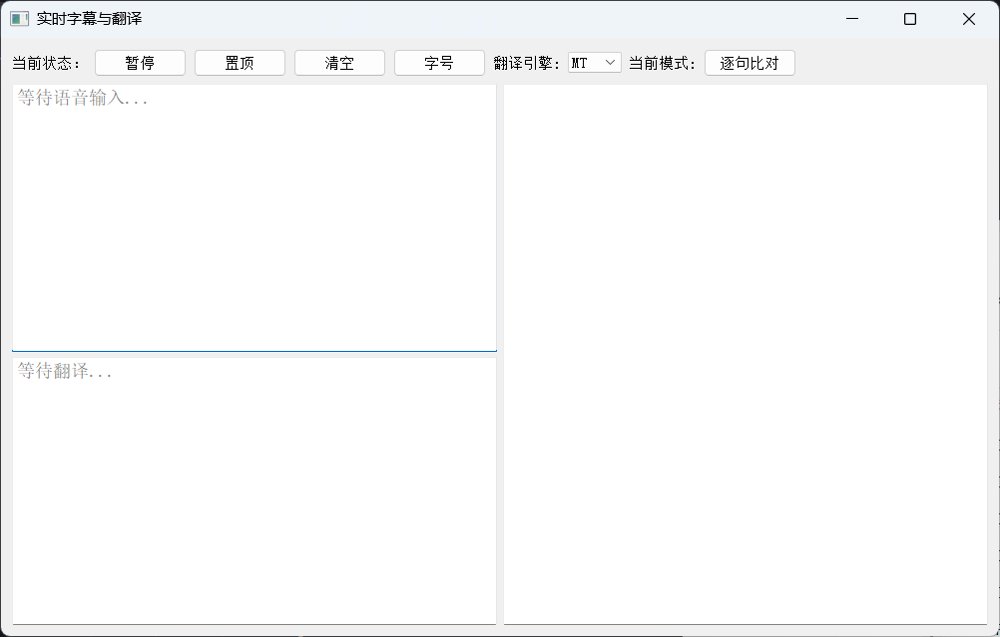
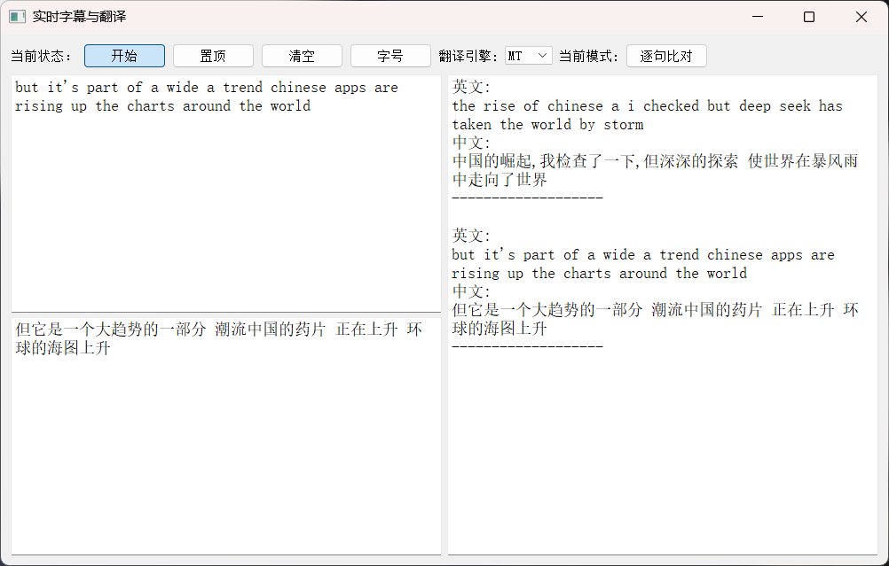
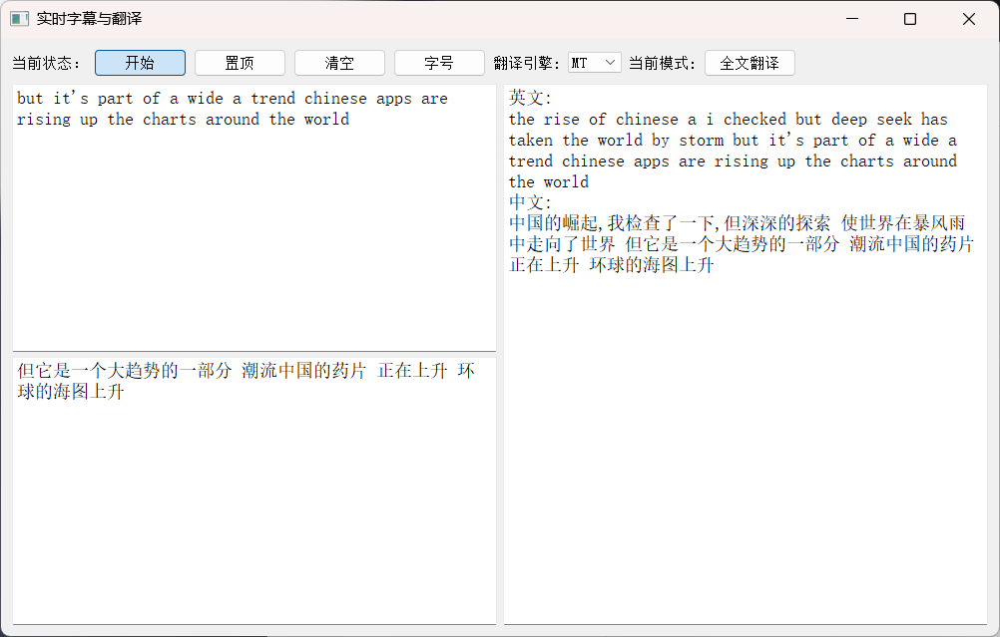

# Real-time Subtitles & Translation

[中文版介绍](README.md)

## Overview



This is a software I developed that displays English subtitles and Chinese translations in real-time based on system audio. Its features are as follows:

- Upon opening the software, it defaults to a paused state. You need to click a button to enter the start state, at which point it begins recognizing English. The current English sentence is displayed in the top-left text box, the translation result of the current sentence is shown in the bottom-left text box, and the right text box displays historical information (the left side only shows the currently recognized sentence, while the right side displays all sentences from the start to the present);
- The "翻译引擎" button controls two translation modes. The default is "MT" (Machine Translation) mode, and you can switch to "LLM" (Large Language Model) mode. For details on the model used, refer to the `llm_translate` function;
- The "当前模式" button controls the display format of the historical information box (it only switches the display mode and does not modify the data). The default is "Sentence-by-Sentence Comparison" mode, which can be switched to "Global Translation" mode (Sentence-by-Sentence Comparison mode refers to the recognized sentences and their translations being displayed one-to-one, while Global Translation mode integrates all recognized English sentences and their translations into one large paragraph);
- The "置顶" button can keep the software on top for easy viewing (for practical use, if the user manually minimizes or uses the taskbar icon, it can still be minimized, but switching directly between software windows will not overlay it);
- The "清空" button will empty the data in all three text boxes, but the saved record file will not be cleared;
- The "字号" button: defaults to medium;
- The software has an auto-save feature, which automatically creates a record folder and generates a new record file.

## Installation

`pip install -r requirements.txt`

## DEMO

For the documentary released by BBC on YouTube: [How China is taking the lead in tech](https://www.youtube.com/watch?v=z7do1hhb6fE&t=95s) to identify:





**record_fulltext_20250221_110432.txt**
```text
=== 实时字幕与翻译记录 ===

[2025-02-21 11:04:52]
英文:
the rise of chinese a i checked but deep seek has taken the world by storm but it's part of a wide a trend chinese apps are rising up the charts around the world
中文:
中国的崛起,我检查了一下,但深深的探索 使世界在暴风雨中走向了世界 但它是一个大趋势的一部分 潮流中国的药片 正在上升 环球的海图上升
```
**record_sentence_20250221_110432.txt**
```text
=== 实时字幕与翻译记录 ===
开始时间: 2025-02-21 11:04:32

[2025-02-21 11:04:46]
英文:
the rise of chinese a i checked but deep seek has taken the world by storm
中文:
中国的崛起,我检查了一下,但深深的探索 使世界在暴风雨中走向了世界

-------------------
[2025-02-21 11:04:52]
英文:
but it's part of a wide a trend chinese apps are rising up the charts around the world
中文:
但它是一个大趋势的一部分 潮流中国的药片 正在上升 环球的海图上升

-------------------
```

## Troubleshooting

<details>
<summary>The software cannot recognize speech</summary>
Currently, it only supports recognizing audio signals output from the computer speakers. Please check if the audio output device being used is the computer speakers.
</details>

<details>
<summary>Only supports English to Chinese translation?</summary>
Currently, it only supports recognizing English and translating it into Chinese. You can download other language packs (you may need to modify the recognized audio signals based on language characteristics) and then modify the corresponding parameters in `vosk_models`, `translator_configs`, `tokenizer`, and `translator`.
</details>
